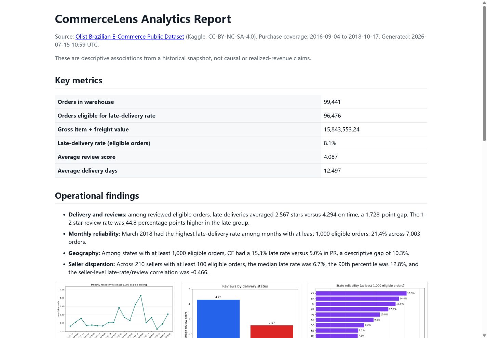

# CommerceLens Analytics Warehouse

CommerceLens is a reproducible local analytics warehouse for the public Olist Brazilian E-Commerce dataset. It answers a focused operations question: which customer, seller, and delivery factors are associated with late delivery and lower review scores?

The project demonstrates ingestion, relational staging, DuckDB marts, executable quality checks, minimum-sample analytical comparisons, and a static report published with GitHub Pages. It is intentionally not a live dashboard or a causal study.

## Public report

[View the live analytics report](https://momo9113-coder.github.io/commercelens-analytics-warehouse/).

The page publishes pre-generated HTML and charts from a dated full local snapshot; raw data and the DuckDB file are never committed. CI uses the small fixture only to verify that the pipeline still runs.



## Data

The primary source is the [Olist Brazilian E-Commerce Public Dataset](https://www.kaggle.com/datasets/olistbr/brazilian-ecommerce), licensed `CC-BY-NC-SA-4.0` on Kaggle. Download the public zip with Kaggle CLI or place an equivalent licensed snapshot under `data/raw/`. Never commit Kaggle credentials or the raw archive.

Expected files include:

- `olist_orders_dataset.csv`
- `olist_order_items_dataset.csv`
- `olist_order_payments_dataset.csv`
- `olist_order_reviews_dataset.csv`
- `olist_customers_dataset.csv`
- `olist_products_dataset.csv`
- `olist_sellers_dataset.csv`

The repository includes a tiny fixture under `data/fixtures/` so tests and the Pages build do not depend on network access.

The committed [snapshot manifest](data/snapshot_manifest.json) fingerprints the seven full-data inputs by filename, byte size, and SHA-256 without publishing raw rows or local paths.

## Local setup

```powershell
python -m venv .venv
.\.venv\Scripts\Activate.ps1
python -m pip install --upgrade pip
python -m pip install -r requirements-data.txt
python scripts/download_olist.py --data-dir data/raw
python -m commercelens.cli snapshot --data-dir data/raw --output data/snapshot_manifest.json
python -m commercelens.cli report --data-dir data/raw --db-path reports/commercelens.duckdb --output-dir site
python -m pytest
```

`requirements.txt` pins the verified runtime, `requirements-dev.txt` adds CI test tooling, and `requirements-data.txt` adds the Kaggle downloader. `pyproject.toml` retains compatibility lower bounds for package metadata.

For a fast network-free smoke test, use the versioned fixture instead:

```powershell
python -m commercelens.cli report --data-dir data/fixtures --db-path reports/fixture.duckdb --output-dir site
python -m pytest
```

For a full local analysis, replace `data/fixtures` with the directory containing the licensed Olist CSV snapshot. The report command runs the staging and mart SQL before exporting metrics and charts.

## Data flow

```text
CSV snapshot -> raw_* tables -> stg_* tables -> fct_orders / marts -> quality checks -> static report
```

Nine quality checks cover duplicate keys, orphan relationships, numeric ranges, timestamp order, allowed statuses, mart grain, and late-delivery denominator eligibility. The report includes order volume, gross item-plus-freight value, delivery/review association, monthly reliability, state comparisons, and seller dispersion.

## First full-snapshot run (2026-07-15)

The dated Olist snapshot built 99,441 order facts after all nine quality checks passed. Of these, 96,476 had both actual and estimated delivery timestamps and were eligible for the 8.11% late-delivery rate. Aggregate gross item-plus-freight value was 15,843,553.24 and average review score was 4.087.

## Dated findings

- Among 95,830 reviewed eligible orders, late deliveries averaged 2.567 stars versus 4.294 on time; the 1-2 star review rate was 44.8 percentage points higher in the late group.
- March 2018 had a 21.36% late-delivery rate across 7,003 eligible orders, the highest among months with at least 1,000 eligible orders.
- Among states with at least 1,000 eligible orders, rates ranged from 5.00% in PR to 15.32% in CE.
- Across 210 sellers with at least 100 eligible orders, the median late rate was 6.75%, the 90th percentile was 12.76%, and the late-rate/review correlation was -0.466.

Read the [full methodology, tables, and limitations](docs/ANALYSIS.md). These are descriptive snapshot associations, not causal, commercial, or individual-performance claims.

## Public deployment

GitHub Actions tests the pipeline against the fixture and publishes the committed `site/` directory with GitHub Pages. The full DuckDB rebuild remains a local reproducible command. GitHub Pages is a static host, so no database password, server process, or persistent disk is required.

## Limitations

The dataset is a historical observational snapshot. Results are descriptive associations, not causal claims. Comparisons are not adjusted for product mix, distance, carrier, seasonality, or missingness. The fixture is too small for business conclusions and exists only for tests. Full-data numbers must be regenerated from the fingerprinted source snapshot before being used in a CV or application.

## License

Code is released under the MIT license. The dataset is not redistributed here and remains subject to its own license and terms.
